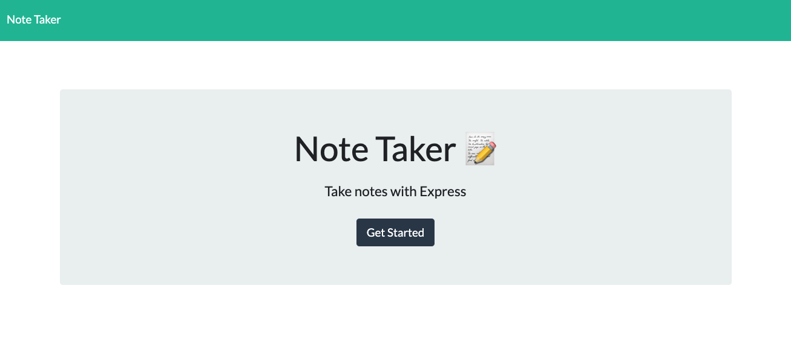
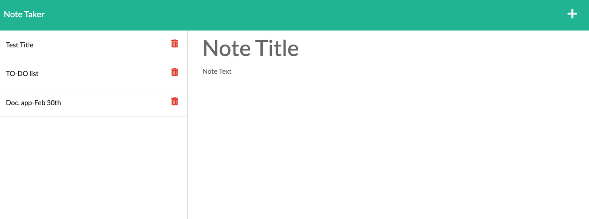

# Chapter 11: Dream Team Note Taker
by: Yonas Woldemichael

## Description
Student was tasked with writing code to create an application called Note Taker that can be used to write and save notes. This application will use an Express.js back end and will save and retrieve note data from a JSON file.

## Table of Contents
- [Description](#description)
- [Visuals](#visuals)
- [Usage](#usage)
- [Links](#links)

## Notes
1. Note taker allows you to create a note
2. Note taker allows you to delete a note
3. The application was also deployed to heroku. The link will be below
4. A screenshot of the app will be displayed below

## Visuals
This is what the homepage of the app looks like when first opened up.

This is the second page where notes can be logged

## Usage 
This app can be used by anyone with a busy schedule.

## Links
This ORM Assignment allowed me to gain some knowledge on how to use Sequelize.

[Link to Repository](https://github.com/Ybyonas1/dream-team-note-taker)

[Link to deployed Heroku site](https://dt-note-taker-yw.herokuapp.com/)